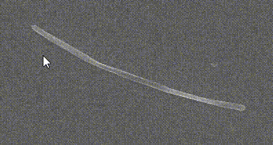

[](https://doi.org/10.1016/j.powtec.2020.08.034)
[](https://arxiv.org/abs/2006.04552)
[](https://github.com/maxfrei750/FiberAnnotator/blob/master/LICENSE) 


# FiberAnnotator
This repository holds a tool for the easy annotation of fibers, as used in the following publication:
[FibeR-CNN: Expanding Mask R-CNN to improve image-based fiber analysis](https://doi.org/10.1016/j.powtec.2020.08.034)

## Table of Contents
   * [FiberAnnotator](#FiberAnnotator)
   * [Table of Contents](#table-of-contents)
   * [Setup](#setup)
   * [Usage](#usage)
   * [Citation](#citation)

## Setup
1. Install [conda](https://conda.io/en/latest/miniconda.html).
2. Open a command line.
3. Clone this repository: `git clone https://github.com/maxfrei750/FiberAnnotator.git`
4. Change into the folder of the repository: `cd FiberAnnotator`
5. Create a new conda environment: 
`conda env create --file environment.yml`
6. Change the `IMAGE_GLOB` constant in `FiberAnnotator.py`, to a regular expression that matches the images that you want to annotate.
8. Activate the conda environment: `activate FiberAnnotator`
9. Run the annotation tool: `python3 FiberAnnotator.py`

## Usage



* <kbd>Left Click</kbd>: place keypoint/select keypoint
* <kbd>Right Click</kbd>: delete last keypoint
* <kbd>Up</kbd> / <kbd>Down</kbd> / <kbd>Left</kbd> / <kbd>Right</kbd>: move active keypoint
* <kbd>W</kbd> / <kbd>A</kbd> / <kbd>S</kbd> / <kbd>D</kbd>: move active keypoint
* <kbd>Mouse Wheel Up</kbd> / <kbd>Mouse Wheel Down</kbd>: increase/decrease thickness of active fiber
* <kbd>Space</kbd>: end annotation of current fiber
* <kbd>Del</kbd>: delete current/last fiber
* <kbd>Enter</kbd> / <kbd>E</kbd>: end annotation of current image

## Citation
If you use this annotation tool for a publication, then please cite it using the following bibtex-entry:
```
@article{Frei.2020,
	title = {{FibeR}-{CNN}: {Expanding} {Mask} {R}-{CNN} to improve image-based fiber analysis},
	issn = {0032-5910},
	url = {https://doi.org/10.1016/j.powtec.2020.08.034},
	doi = {10.1016/j.powtec.2020.08.034},
	journal = {Powder Technology},
	author = {Frei, M. and Kruis, F. E.},
	year = {2020},
}
```
